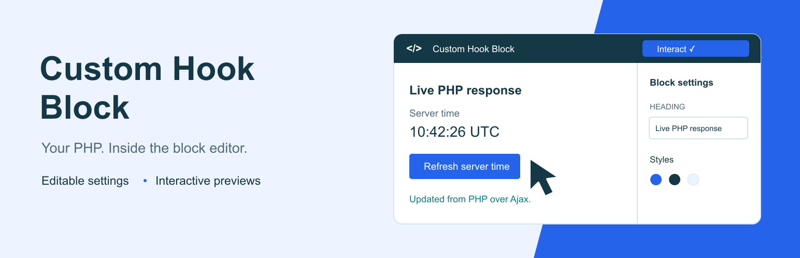
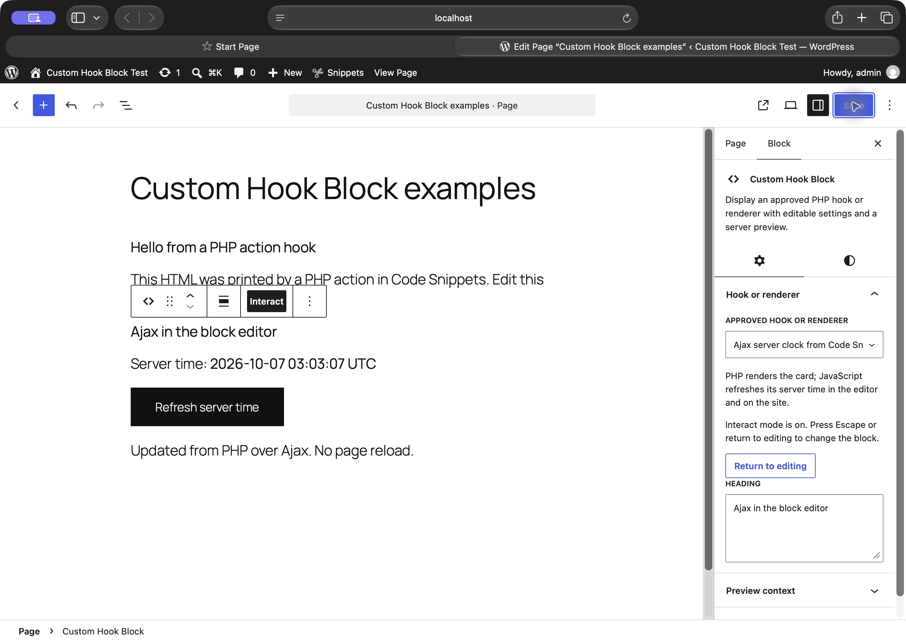

<p align="center"></p>



# Custom Hook Block

Place PHP output in the block editor using an approved WordPress hook or renderer. Editors can change its settings and appearance, then test supported interactions in the editor. Developers keep the code in a plugin, theme, or PHP snippet.

[Download the installable ZIP](https://github.com/danielk-am/custom-hook-block/releases/latest) · [Report an issue](https://github.com/danielk-am/custom-hook-block/issues)

## What it does

- Captures output from explicitly registered display hooks, including existing `add_action` callbacks.
- Includes a working Notice renderer with editable heading and message.
- Generates settings controls from typed PHP definitions.
- Shows the same PHP-rendered content in the editor and on the site.
- Supports native colours, typography, spacing, and borders.
- Lets you search for a record to preview without saving that preview choice into the page.
- Loads registered CSS and JavaScript assets for developer integrations.
- Offers a temporary **Interact** mode for components with an approved editor initializer.

The renderer adds no default background box or padding. Its callback supplies the HTML; the theme and optional block style choices determine its appearance.

PHP code lives in your plugin or theme. Editors change typed settings rather than executable source. ACF and WooCommerce are optional integrations.

## Editor screenshot

Select the Ajax example, turn on **Interact**, and refresh the server time directly in the editor. This screenshot shows a successful PHP response after changing and saving its heading. The banner above is an illustration; the screenshot is the real WordPress editor.



## Code Snippets and Ajax examples

[See the working PHP and Ajax examples](docs/examples/README.md), including source in Code Snippets, block-editor previews and the frontend result.

## Install

Requires WordPress 6.9 or later and PHP 7.4 or later. ACF, WooCommerce, and Code Snippets are optional.

1. Download the installable ZIP from [Releases](https://github.com/danielk-am/custom-hook-block/releases), or build the source using the commands below.
2. Upload the `custom-hook-block` folder into `wp-content/plugins`, or upload its installable ZIP through Plugins.
3. Deactivate Registered Render Blocks if it is active, then activate Custom Hook Block.
4. Insert **Custom Hook Block** and choose **Notice**, or select an approved hook added by your developer.
5. Adjust the content under **Hook or renderer** and use the native Styles controls for its appearance.

New blocks start with an empty choice. Existing blocks retain their saved names and settings. Review [migration](#migration-and-compatibility) before upgrading a version 1.0 installation.

## Build and check

```sh
npm ci
npm run build
npm run lint:js
npm run lint:css
npm run lint:php
```

Source is in `src/renderer/`; generated assets are in `build/renderer/`. The normal `@wordpress/scripts` build is used without custom webpack configuration. Build tools are development dependencies, not executed by WordPress.

Run the runtime suite on a disposable WordPress site with this plugin active:

```sh
studio wp eval-file /absolute/path/to/custom-hook-block/tests/run.php
studio wp eval-file /absolute/path/to/custom-hook-block/tests/interactive.php
node tests/preview-registry.mjs
```

The suite creates and removes fixture posts and users. It covers hook output, recursion, buffer cleanup, both block identities, malformed settings, HTML escaping, frontend context, and preview permissions. Never run fixture tests on production.

Coactivation checks run separately against an unmodified copy of Registered Render Blocks:

```sh
php tests/coactivation.php old-first /path/to/registered-render-blocks.php
php tests/coactivation.php new-first /path/to/registered-render-blocks.php
```

`tests/site-adapter.php` is an optional integration suite for the separately installed Asia Mannequin measurement adapter. It is not required for generic plugin use and fails deliberately when that adapter is absent.

## Register a display hook

Keep your existing `add_action` callback and register its dedicated display hook. A complete example is available as [echo-hook.php](docs/examples/echo-hook.php) for use in a plugin or a PHP snippet.

```php
add_action( 'my_custom_hook', function ( $settings, $context ) {
    echo '<p>' . esc_html( $settings['message'] ) . '</p>';
}, 10, 2 );

add_action( 'chb_register_renderers', function () {
    chb_register_hook( 'my_custom_hook', array(
        'title' => 'My display hook',
        'settings' => array(
            'message' => array(
                'type' => 'string', 'title' => 'Message',
                'default' => 'Hello from a WordPress hook',
            ),
        ),
    ) );
} );
```

Choose **My display hook** in the block sidebar. The callback receives validated settings and the current context. Existing callbacks that accept no arguments can continue to echo their content.

`chb_register_hook($hook_name, $definition)` accepts a required `title`, optional `description`, a `settings` map, the three asset-handle lists described below, and an optional boolean `interactive` (default `false`). It returns `true` or `WP_Error`. Hook names start with a letter and contain only letters, digits, and underscores, up to 100 characters.

Register each hook once. `callback` and `legacy_hooks` are supplied internally and cannot appear in a hook definition. Only the exact registered action is dispatched. Recursion into the same hook is stopped, and output buffers are cleaned if a callback throws.

Use dedicated display actions only. Never register lifecycle, administrative, payment, or other actions that change data. Every callback attached to the registered action can run during a preview or page render, so audit all of them.

## Register a renderer

Register on `chb_register_renderers` (runs on `init` at priority 9). All registration arguments come from trusted PHP, never REST or stored block content.

```php
add_action( 'chb_register_renderers', function () {
    wp_register_style( 'my-product-facts', plugins_url( 'facts.css', __FILE__ ), array(), '1.0' );
    $registered = chb_register_renderer( 'my/product-facts', array(
        'title'       => __( 'Product facts', 'my-plugin' ),
        'description' => __( 'Verified details for the current product.', 'my-plugin' ),
        'settings'    => array(
            'heading' => array( 'type' => 'string', 'title' => __( 'Heading', 'my-plugin' ), 'default' => 'Product facts', 'maxLength' => 120 ),
            'layout'  => array( 'type' => 'string', 'title' => __( 'Layout', 'my-plugin' ), 'enum' => array( 'table', 'list' ), 'default' => 'table' ),
            'showHeading' => array( 'type' => 'boolean', 'title' => __( 'Show heading', 'my-plugin' ), 'default' => true ),
        ),
        'callback' => function ( $settings, $context ) {
            $post_id = $context['post_id'];
            if ( ! $post_id ) {
                return $context['preview'] ? '<p>' . esc_html__( 'Choose a preview product.', 'my-plugin' ) . '</p>' : '';
            }
            return '<h3>' . esc_html( $settings['heading'] ) . '</h3>';
        },
        'style_handles' => array( 'my-product-facts' ),
        'view_script_handles' => array(),
        'editor_script_handles' => array(),
        'legacy_hooks' => array( 'my_product_facts_hook' ),
    ) );
    // $registered is true or WP_Error. Treat a WP_Error as a registration defect.
} );
```

The ID is a lowercase slug, optionally `namespace/slug`, maximum 100 characters. It must be unique.

`title` and callable `callback` are required. `settings` is a property map, not a full object-schema wrapper.

Each property requires `type` and `default`; permitted schema keys are `type`, `title`, `description`, `default`, `enum`, `minimum`, `maximum`, `maxLength`. Supported types are `string`, `boolean`, `number`, `integer`. Defaults are applied before the callback.

Unknown settings and invalid types fail closed; no string-to-number/boolean coercion. String settings are bounded at 10,000 characters, default 2,000.

Callback signature: `callback(array $settings, array $context): string`. Context contains `post_id` (integer) and `preview` (boolean).

Post context comes from the block's `postId` first, then the singular queried post.

A frontend render never reads a preview-post attribute. In core SSR, the context must match the authorized request post ID. Preview selection is React component state, never a serialized block attribute.

Frontend rendering also refuses password-protected contextual posts and nonpublic posts the current visitor cannot read. Integrations remain responsible for field-level visibility and avoiding private metadata on otherwise public posts.

The framework trusts registered PHP callback output because integrations may need semantic HTML and scripts registered separately.

Escape dynamic values for the exact output context (`esc_html`, `esc_attr`, `esc_url`, `wp_kses_post`). Do not execute settings as code.

Renderer callbacks return HTML. Display-hook callbacks echo HTML. Neither may update data, send messages, invoke transactions, or dispatch unrelated actions during rendering.

Return an empty string when frontend content is unavailable. On a record-less preview, return an explicit sample/selection message rather than reading unrelated global data.

`style_handles` load on rendered frontend blocks and in the editor canvas. `view_script_handles` load only on a nonempty frontend render. `editor_script_handles` opt in trusted editor-only scripts.

Register handles before the corresponding enqueue hook; source URLs and executable strings are not accepted as renderer settings.

Scope CSS to `.rrb-renderer--my-product-facts` or renderer-owned classes. Core block support styles are applied by the block wrapper in both editor and frontend.

## Interactive editor previews

Select a supported block and turn on **Interact** in its toolbar. Its buttons and controls become usable inside the editor, including Ajax requests. Turn Interact off or press Escape to return to normal block editing. This choice is temporary and is never saved into page content.

Existing renderers stay non-interactive until their developer opts in. This does not automatically make every frontend script work in the editor: its DOM belongs to the editor iframe, and PHP previews are replaced when settings change.

In the PHP registration, set `interactive` to `true` and supply an `editor_script_handles` asset. That trusted editor script registers an initializer:

```js
window.chbEditor.registerPreview('my/product-facts', ({ root, settings, context, signal }) => {
    const button = root.querySelector('button');
    const onClick = () => { /* Update this preview only. */ };
    button?.addEventListener('click', onClick);
    return () => button?.removeEventListener('click', onClick);
});
```

For a display hook registered with `chb_register_hook`, the initializer ID is `hook-` followed by the PHP `md5($hook_name)`. Pass that value into your editor asset using `wp_json_encode`; keep the existing `add_action` callback. The same opt-in and cleanup rules apply.

`root` is this preview's DOM container. Use `root.ownerDocument` for its document and `root.ownerDocument.defaultView` for browser APIs. `settings` includes declared defaults; `context` contains `post_id` and `preview: true`. Keep listeners and queries within this root so multiple blocks work independently.

The initializer must synchronously return a cleanup function or `undefined`. Its abort signal is cancelled before cleanup when Interact stops, the block unmounts, or settings, context or rendered output change. Pass the signal to requests, or abort your own controllers during cleanup. Check it before applying asynchronous results. The [Ajax clock example](docs/examples/ajax-clock.php) demonstrates this for a PHP snippet.

Editor handles load after the plugin's editor API. Frontend handles remain separate. The plugin does not execute script tags from the PHP preview or copy frontend scripts into the editor. This lifecycle is for trusted display components; it does not authorize an endpoint to change data. Integrations must enforce endpoint permissions and CSRF protection where needed.

## Preview security

The plugin uses the built-in `/wp/v2/block-renderer/mytheme/custom-hook-block` route (and the Registered Render Blocks compatibility route), authenticated by WordPress. Core validates registered block attributes.

An additional permission guard requires `edit_post` for a selected record, or `edit_theme_options` for no-post template preview. Core retains its own permission check as well.

Anonymous callers and users without access to another author's private post cannot invoke a preview. No custom REST route or nonce scheme is introduced.

The `previewPostId` attribute is intentionally absent. Sending it to REST fails schema validation; embedding it in frontend content cannot change renderer context. Preview state is cleared after the core REST callback.

## Migration and compatibility

**From Custom Hook Block 1.0:** the visible block keeps its original `mytheme/custom-hook-block` identity. Version 2.0 requires explicit hook registration. A saved hook that has not been registered shows an editor warning and produces no frontend output.

Register every reviewed display hook with `chb_register_hook`. Old blocks without a saved `hookName` represent `my_custom_hook`; register that action explicitly to restore their output. The plugin never edits saved posts during activation.

**From Registered Render Blocks:** saved `registered-render-blocks/renderer` blocks remain supported as a hidden compatibility block. Their renderer IDs, settings, style attributes, and Notice default remain intact. New insertions use Custom Hook Block and start with an empty choice.

The `rrb_register_renderer` API and `rrb_register_renderers` action remain available. `chb_register_renderer` is the canonical equivalent. Both actions fire during `init` at priority 9, with the `chb_` action first. Register an integration on one action only to avoid duplicate IDs.

The APIs become available during `plugins_loaded` at priority 0. Integrations should attach their registration callback to either registration action, rather than calling the API while another plugin's main file loads.

**Coactivation:** deactivate Registered Render Blocks before using Custom Hook Block. If both are active, Custom Hook Block pauses its own provider and displays an administrator notice. This prevents duplicate-function errors in either load order.

Its new `chb_` APIs are unavailable while paused.

A renderer may still map old hook names through `legacy_hooks`. A valid saved renderer takes precedence over the hook name. An unknown nonempty renderer ID does not fall back to executing a hook.

## Version status and validation

Version 2.1.0 adds interactive editor previews to the combined Custom Hook Block plugin. It has not been submitted to or approved by WordPress.org.

The 2.1.0 build passed 109 PHP runtime and integration checks (68 existing, 31 interactive-preview, 10 site-adapter) and 26 JavaScript registration/lifecycle checks on WordPress 7.1.2 and PHP 8.4.

Build, JavaScript/CSS lint, and PHP syntax checks passed. The declared minimum WordPress and PHP versions have not been tested separately.

Plugin Check 2.1.0 passed on the extracted 2.1.0 ZIP fileset with no findings. Its 29 static checks ran; five runtime asset checks were unavailable in Studio. Direct browser checks confirmed hook rendering, saved editor settings, transparent wrappers without padding, and the example Ajax interaction. The interactive screenshot shows a real post-editor Ajax response after a settings refresh. Two concurrent instances and Escape were also checked. A separate Site Editor interaction check could not run because the browser security check was unavailable; minimum-version and Site Editor-specific verification remain open.

## Artwork and licence

Directory-ready banner, icon and screenshot files are in `.wordpress-org/`; editable SVG artwork is in `design/`. The banner is illustrative, and the screenshot uses synthetic demonstration content. Code and original artwork are GPL-2.0-or-later. Author: Daniel Kam.
