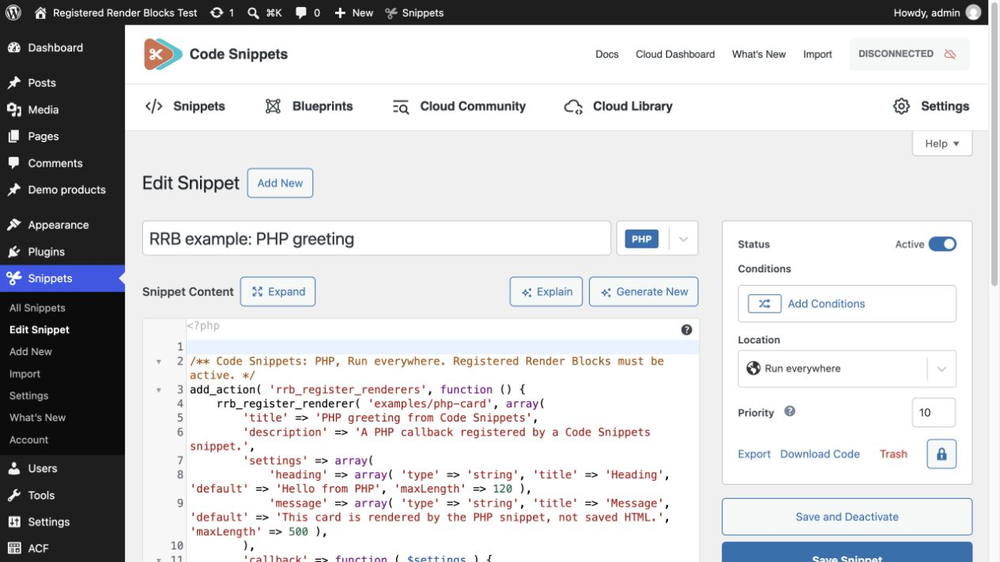
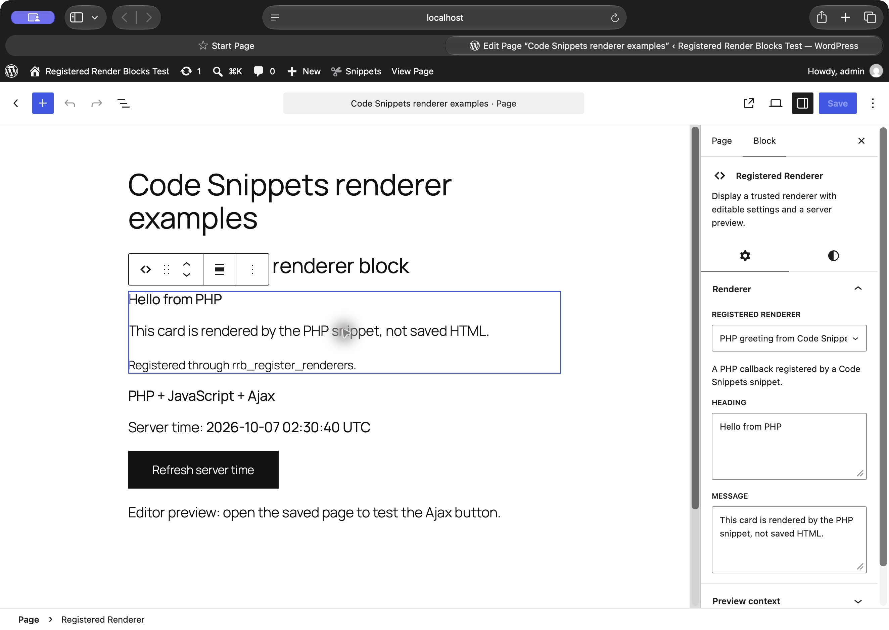
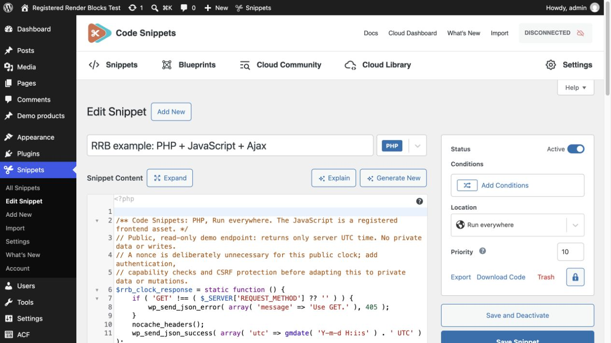
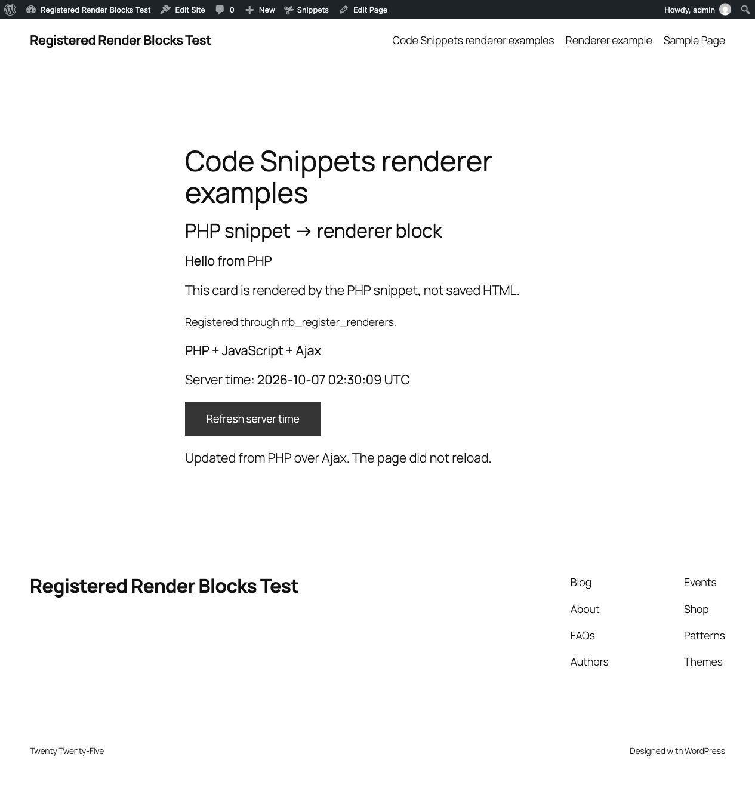
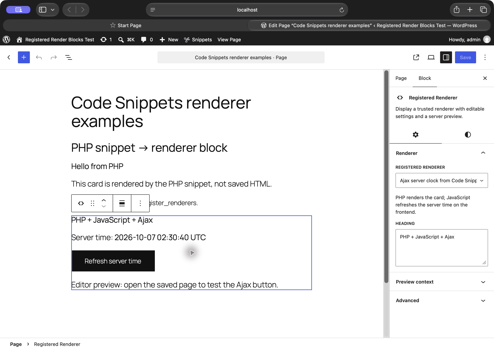

# Code Snippets → PHP renderer → interactive frontend

These are working examples captured on 7 October 2026 with Registered Render Blocks 0.1.0, Code Snippets Pro 3.10.2, WordPress 7.1.2 and PHP 8.4 in a disposable local test site. They use synthetic content, not customer or catalogue data. Code Snippets itself is not included in this repository.

## 1. PHP snippet with editable block settings

Create a **PHP** snippet in Code Snippets, copy [php-card.php](php-card.php) without its opening `<?php`, select **Run everywhere**, and activate it. Registered Render Blocks must be active. Running everywhere allows registration on the frontend and editor preview requests.

Insert **Registered Renderer** and choose **PHP greeting from Code Snippets**. The snippet registers `examples/php-card` on `rrb_register_renderers`; its callback returns escaped HTML. The heading and message become settings in the block sidebar. The examples use the snippet output with the theme’s normal styles: no background box or padding is added. Native block Styles controls remain optional. The thin editor selection outline is WordPress UI, not frontend markup.

This uses the new renderer registration hook. It does not execute arbitrary hook names entered by editors.

## 2. JavaScript and Ajax, managed by a PHP snippet

Create another **PHP** snippet from [ajax-clock.php](ajax-clock.php), omit the opening `<?php`, choose **Run everywhere**, and activate it. Insert **Registered Renderer** and choose **Ajax server clock from Code Snippets**.

This single snippet registers:

1. A PHP callback returning the clock card.
2. A trusted frontend JavaScript asset using WordPress's script API.
3. A public, read-only Ajax endpoint that returns only the server UTC time.

The renderer's `view_script_handles` loads the JavaScript when this block renders on the frontend. Click **Refresh server time** on the saved page: JavaScript requests a new timestamp from PHP and updates this card without reloading the page. Loading, timeout and error states are included.

[ajax-clock.js](ajax-clock.js) is a readable companion copy of the script embedded in the PHP snippet. **Do not activate both copies**; that would duplicate event listeners.

## Editor preview versus frontend interaction

The editor shows PHP output, settings and native styling. Its server preview is intentionally non-interactive, and `view_script_handles` does not run there. Use the saved page for the Ajax button. Loading an editor script does not automatically initialize frontend widgets inside the editor iframe or after a server-preview refresh.

## What about a separate Code Snippets Pro JavaScript snippet?

The screenshots and tests above demonstrate **PHP-managed JavaScript through Code Snippets Pro's PHP snippet type**. They do not demonstrate the separate Pro JavaScript snippet loader.

Source inspection of Code Snippets Pro 3.10.2 shows a native frontend-footer JavaScript snippet path, subject to its licensing and location/condition settings. With that feature enabled, the JavaScript can live separately while PHP keeps the renderer and endpoint. Remove the PHP script registration, inline JavaScript and `view_script_handles` entry before activating that separate copy. Account for its loading conditions; a component selector prevents activity on pages without the block, but does not itself prevent a global script download. This separate-loader arrangement has not been run in this disposable site's unlicensed copy, and no licence check was bypassed.

## Verification and scope

- Both PHP snippets saved active through Code Snippets' own API, with no reported code error.
- Both renderers appeared in the block editor and produced their PHP previews.
- Real frontend click changed the server time from `02:11:41 UTC` to `02:11:50 UTC`; the status confirmed the Ajax result without a page reload.
- Anonymous Ajax GET returned HTTP200 and only the public timestamp. POST returned HTTP405.
- A page without this block did not load the example JavaScript asset.
- Independent source review passed: contextual escaping, read-only endpoint, scoped DOM updates, text-only insertion, duplicate-click protection and timeout/error recovery.

This clock intentionally uses no nonce because it provides public read-only data and performs no mutation. Do not copy that assumption into account data, product management or transactional endpoints: add the appropriate authentication, object/capability checks and CSRF protection. A nonce alone is not authorization.

These examples are opt-in documentation and excluded from the installable plugin ZIP. The plugin does not activate snippets or create endpoints by itself.
