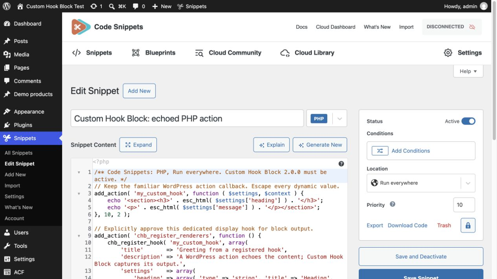
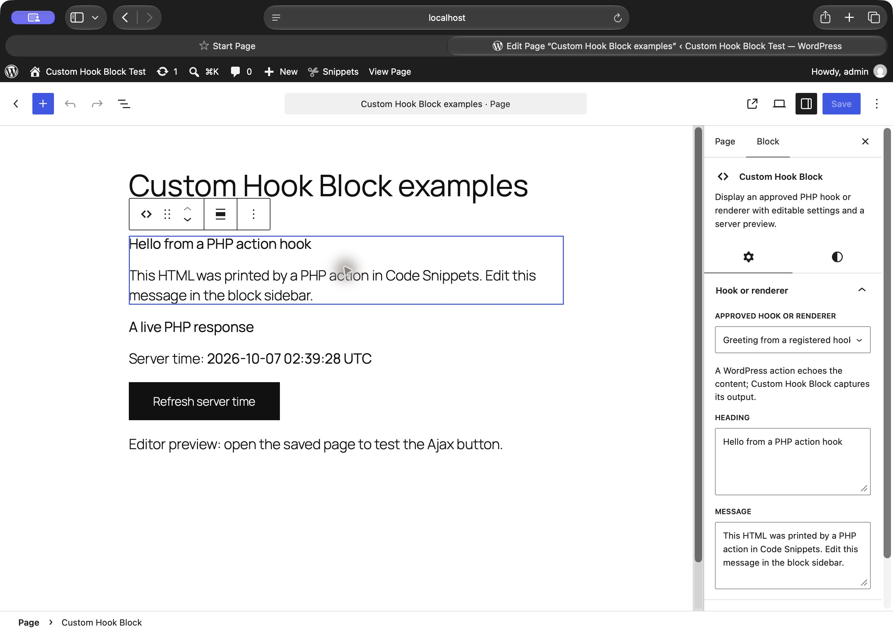
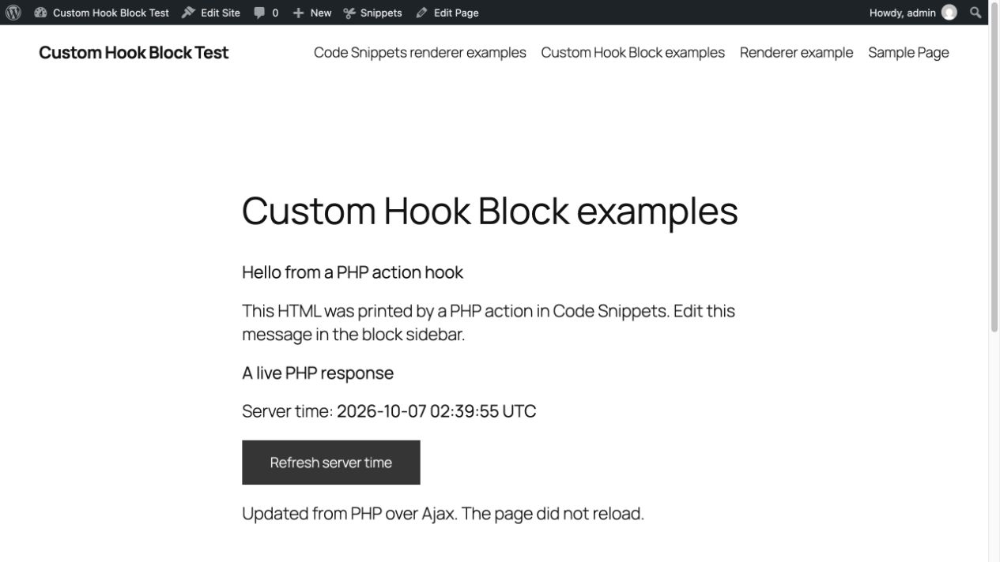

# PHP hooks, renderers, and Ajax examples

Use these optional PHP snippets to add approved output to **Custom Hook Block 2.0.0**. They use demonstration content and add no background box or padding. Code Snippets is optional and is not bundled.

The PHP renderer and Ajax images in sections 2 and 3 are historical captures from Registered Render Blocks 0.1.0 on WordPress 7.1.2 and PHP 8.4, using Code Snippets Pro 3.10.2. Their block labels and API names predate the updated source examples. The current hook screenshots are labelled separately.

## 1. A WordPress action that echoes content

1. Create a PHP snippet from [echo-hook.php](echo-hook.php), omitting the opening `<?php` in Code Snippets.
2. Select **Run everywhere** and activate it with Custom Hook Block active.
3. Insert **Custom Hook Block** and choose **Greeting from a registered hook**.
4. Edit **Heading** and **Message** in the block sidebar.

This current capture shows the registered hook in 2.0.0. The heading was edited, saved, and reloaded.

The frontend capture shows the action output alongside the Ajax demo. A real button click changed the clock from `02:39:50 UTC` to `02:39:55 UTC` and showed the success status. Both block wrappers had transparent backgrounds and `0px` padding.

The example keeps `add_action('my_custom_hook', ...)` and explicitly approves that action through `chb_register_hook`. Its callback echoes escaped HTML. The block captures the output for the editor and frontend.

Old Custom Hook Block 1.0 content without a saved hook name used `my_custom_hook`. This example demonstrates its explicit registration. Only use it on a test site unless you have reviewed every callback already attached to that action.

## 2. A PHP callback that returns content

1. Create a PHP snippet from [php-card.php](php-card.php), omitting the opening `<?php` in Code Snippets.
2. Select **Run everywhere** and activate it with Custom Hook Block active.
3. Insert **Custom Hook Block** and choose **PHP greeting from Code Snippets**.

Running everywhere allows registration on the frontend and editor preview requests. The snippet registers `examples/php-card` on `chb_register_renderers`; its callback returns escaped HTML. The heading and message become settings in the block sidebar. The examples use the snippet output with the theme’s normal styles: no background box or padding is added. Native block Styles controls remain optional. The thin editor selection outline is WordPress UI, not frontend markup.

This uses the new renderer registration hook. It does not execute arbitrary hook names entered by editors.

## 3. JavaScript and Ajax, managed by a PHP snippet

1. Create a PHP snippet from [ajax-clock.php](ajax-clock.php), omitting the opening `<?php` in Code Snippets.
2. Select **Run everywhere** and activate it.
3. Insert **Custom Hook Block** and choose **Ajax server clock from Code Snippets**.

This single snippet registers:

1. A PHP callback returning the clock card.
2. A trusted frontend JavaScript asset using WordPress's script API.
3. A public, read-only Ajax endpoint that returns only the server UTC time.

The renderer's `view_script_handles` loads the JavaScript when this block renders on the frontend. Click **Refresh server time** on the saved page: JavaScript requests a new timestamp from PHP and updates this card without reloading the page. Loading, timeout and error states are included.

[ajax-clock.js](ajax-clock.js) is a readable companion copy of the script embedded in the PHP snippet. **Do not activate both copies**; that would duplicate event listeners.

## Editor preview versus frontend interaction

The editor shows PHP output, settings and native styling. Its server preview is intentionally non-interactive, and `view_script_handles` does not run there. Use the saved page for the Ajax button. Loading an editor script does not automatically initialize frontend widgets inside the editor iframe or after a server-preview refresh.

## What about a separate Code Snippets Pro JavaScript snippet?

The screenshots and tests above demonstrate **PHP-managed JavaScript through Code Snippets Pro's PHP snippet type**. They do not demonstrate the separate Pro JavaScript snippet loader.

Source inspection of Code Snippets Pro 3.10.2 shows a native frontend-footer JavaScript snippet path, subject to its licensing and location/condition settings. With that feature enabled, the JavaScript can live separately while PHP keeps the renderer and endpoint. Remove the PHP script registration, inline JavaScript and `view_script_handles` entry before activating that separate copy. Account for its loading conditions; a component selector prevents activity on pages without the block, but does not itself prevent a global script download. This separate-loader arrangement has not been run in this disposable site's unlicensed copy, and no licence check was bypassed.

## Historical verification and scope

These observations apply to the earlier 0.1.0 screenshots, before the source examples switched to the canonical `chb_` APIs:

- Both PHP snippets saved active through Code Snippets' own API, with no reported code error.
- Both renderers appeared in the block editor and produced their PHP previews.
- Real frontend click changed the server time from `02:11:41 UTC` to `02:11:50 UTC`; the status confirmed the Ajax result without a page reload.
- Anonymous Ajax GET returned HTTP 200 and only the public timestamp. POST returned HTTP 405.
- A page without this block did not load the example JavaScript asset.
- Independent source review passed: contextual escaping, read-only endpoint, scoped DOM updates, text-only insertion, duplicate-click protection and timeout/error recovery.

This clock intentionally uses no nonce because it provides public read-only data and performs no mutation. Do not copy that assumption into account data, product management or transactional endpoints: add the appropriate authentication, object/capability checks and CSRF protection. A nonce alone is not authorization.

These examples are opt-in documentation and excluded from the installable plugin ZIP. The plugin does not activate snippets or create endpoints by itself.

The old `rrb_register_renderer` function and `rrb_register_renderers` action still work in 2.0.0. Register each integration on one action only. Deactivate the separate Registered Render Blocks plugin before testing these canonical `chb_` examples.
